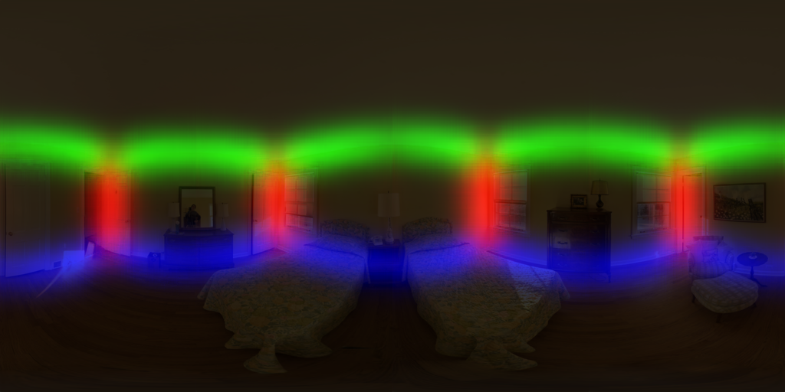
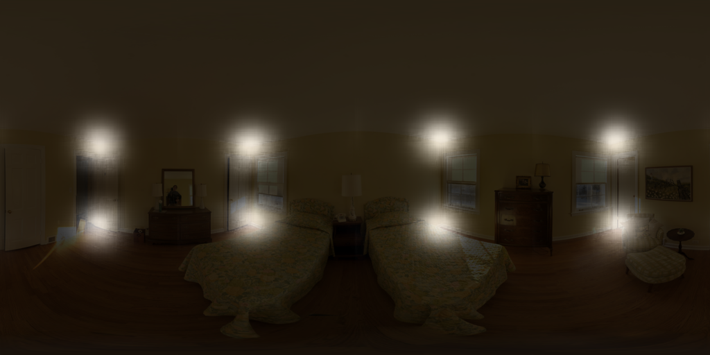
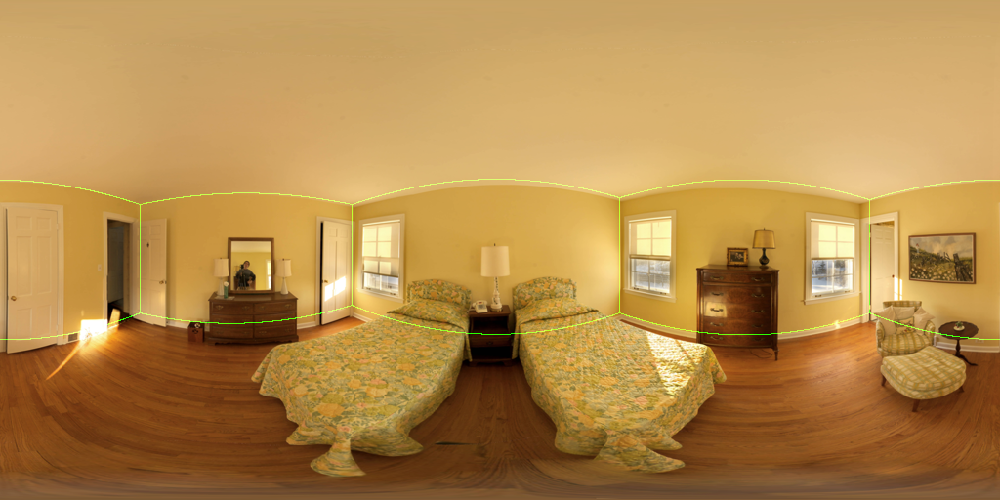

# pytorch-layoutnet
This is an unofficial implementation of CVPR 18 [paper](https://arxiv.org/abs/1803.08999)  "LayoutNet: Reconstructing the 3D Room Layout from a Single RGB Image". [Official](https://github.com/zouchuhang/LayoutNet) layout dataset are all converted to `.png` and pretrained models are converted to pytorch `state-dict`.  
What difference from official:
- **Architecture**: Only joint *bounday branch* and *corner branch* are implemented as the paper states that "Training with 3D regressor has a small impact".
- **Pre-processing**: implementation of *line segment detector* and *pano image alignment* are converted from matlab to python in `pano.py` and `pano_lsd_align.py`.
- **Post-processing**: no 3D layout optimization. Alternatively, this repo smooths the probability map before peak finding and find it help improve testing evaluation metric.

Sampled visualization from testing data:


## Requirements
- Python 3
- pytorch>=0.4.1
- numpy
- scipy
- Pillow
- torchfile
- opencv-python>=3.1 (for pre-processing)

## Preparation
- Download offical [data](https://github.com/zouchuhang/LayoutNet#data) and [pretrained model](https://github.com/zouchuhang/LayoutNet#pretrained-model) as below
```
/pytorch-layoutnet 
  /data
  | /origin
  |   /data  (download and extract from official)
  |   /gt    (download and extract from official)
  /ckpt
    /panofull_*_pretrained.t7  (download and extract from official)
```
- Execute `python torch2pytorch_data.py` to convert `data/origin/**/*` to `data/train`, `data/valid` and `data/test` for pytorch data loader. Under these folder, `img/` contains all raw rgb `.png` while `line/`, `edge/`, `cor/` contain preprocessed Manhattan line segment, ground truth boundary and ground truth corner respectively.
- Use `torch2pytorch_pretrained_weight.py` to convert official pretrained pano model to `encoder`, `edg_decoder`, `cor_decoder` pytorch `state_dict` (see `python torch2pytorch_pretrained_weight.py -h` for more detailed). examples:
  - to convert layout pretrained only
    ```
    python torch2pytorch_pretrained_weight.py --torch_pretrained ckpt/panofull_joint_box_pretrained.t7 --encoder ckpt/pre_full_encoder.pth --edg_decoder ckpt/pre_full_edg_decoder.pth --cor_decoder ckpt/pre_full_cor_decoder.pth
    ```
  - to convert full pretrained (layout regressor branch  will be ignored)
    ```
    python torch2pytorch_pretrained_weight.py --torch_pretrained ckpt/panofull_joint_box_pretrained.t7 --encoder ckpt/pre_full_encoder.pth --edg_decoder ckpt/pre_full_edg_decoder.pth --cor_decoder ckpt/pre_full_cor_decoder.pth
    ```

## Visualization
If you have aligned pano image and corresponding extracted line segments, use `visual.py`, otherwise use `visual_from_scratch.py`.

See `python visual.py -h` for detailed arguments explaination. Basically, `--path_prefix` give the prefix path to 3 `state_dict` to load, `--img_glob` and `--line_glob` tell the input channels of rgb and line segment (remember to add quotes if you use wildcards like `*` in your glob path). Finally `--output_dir` specify the directory to dump the results.  
Execute below command to get the same output as demos.  
```python visual.py --flip --rotate 0.25 0.5 0.75 --img_glob "data/test/img/pano_aaccxxpwmsdgvj.png" --line_glob "data/test/line/pano_aaccxxpwmsdgvj.png" --output_dir assert/```
- output boudary probability map, suffix with `_edg.png`
  
- output corner probability map, suffix with `_cor.png`
  
- output boundary, suffix with `_bon.png` (Note that below result isn't processed by 3D layout optimization)
  
  
If you have rgb pano image only, `visual_from_scratch.py` wraps pre-processing steps (line segments detector + alignment) such that you just have `--line_glob` specifying input rgb images.

## Training
See `python train.py -h` for detailed arguments explanation.  
The default training strategy is the same as official. To launch experiments as official "corner+boundary" setting (`--id` is used to identified the experiment and can be named youself):
```
python train.py --id exp_default
```
To train only using RGB channels as input (no Manhattan line segment):  
```
python train.py --id exp_rgb --input_cat img --input_channels 3
```

## Evaluation
See `python eval.py -h` and `python eval_corner_error.py -h` for more detailed arguments explanation. Examples:  
```
python eval.py --path_prefix ckpt/exp_default/epoch_30
python eval_corner_error.py --path_prefix ckpt/exp_default/epoch_30 --rotate 0.5 --flip
```
*Note* - post-processing component, 3D layout optimization, is not implemented. Alternatively, algorithm yieling initial corner guess are modified to get better result.  

| exp | edg loss | cor loss | Corner error (%) |
| :-: | :------: | :------: | :--------------: |
| panofull_joint_box_pretrained | `0.128767` | `0.085045` | `1.35` | 
| default setting               | `0.116559` | `0.077435` | `0.98` |
| rgb  only                     | `0.124780` | `0.085284` | `1.43` |

- Columns
  - `edg loss` - training objective
  - `cor loss` - training objective
  - `Corner error` - L2 distance between ground truth and predicted corner positions normalized by image diagonal
- Rows
  - `panofull_joint_box_pretrained` - state_dict directly converted from official
  - `default setting` - all hyperparameters are not modified
  - `rgb only` - model only trained with rgb, no line detection as extra features


## References
- [LayoutNet: Reconstructing the 3D Room Layout from a Single RGB Image](https://arxiv.org/abs/1803.08999)
  - Chuhang Zou, Alex Colburn, Qi Shan, Derek Hoiem
  - CVPR2018
  ```
  @inproceedings{zou2018layoutnet,
    title={LayoutNet: Reconstructing the 3D Room Layout from a Single RGB Image},
    author={Zou, Chuhang and Colburn, Alex and Shan, Qi and Hoiem, Derek},
    booktitle={Proceedings of the IEEE Conference on Computer Vision and Pattern Recognition},
    pages={2051--2059},
    year={2018}
  }
  ```
  - [Official torch implementation](https://github.com/zouchuhang/LayoutNet)
